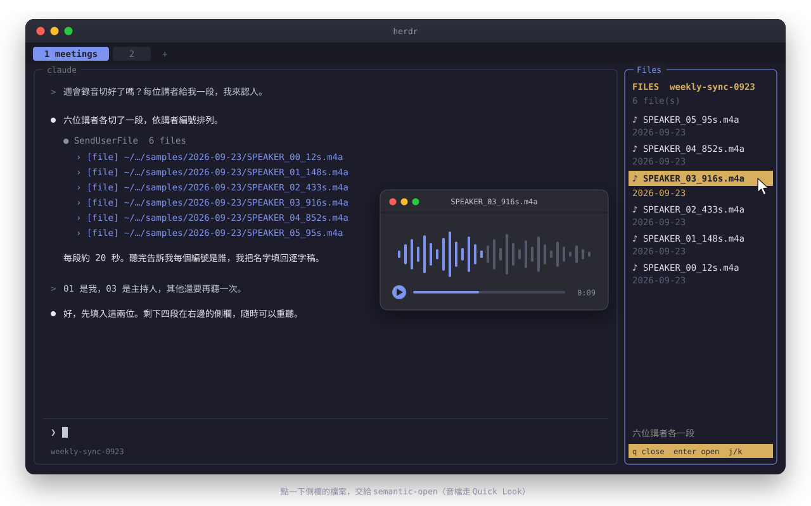

# herdr-shelf

[herdr](https://herdr.dev) 的常駐檔案側欄：列出旁邊那個 Claude Code session 送給你的每一個檔案，最新的在最上面，點一下就用你自己的開檔路由打開。

<p align="center">
  
</p>

## 為什麼

Claude Code 用 `SendUserFile` 送檔時，終端機裡只留下一行 `› [file] ~/…/report.pdf`。圖表、報告、錄音、錄影都一樣，要看得自己去 Finder 找，對話一長，那一行就捲出畫面了。

herdr-shelf 讀的是 session 的逐字檔，不是畫面，所以這個 session 送過的檔案全都在，不會因為捲動而消失。清單只收真正送到你面前的檔案，Claude 讀過或寫過的檔案不算。

## 安裝

需要 `jq` 與 `python3`。Linux 另需 `xdg-open`（Debian／Ubuntu 的 `xdg-utils` 套件），沒設定 `SHELF_OPEN_CMD` 時用它開檔。

```sh
herdr plugin install Clementtang/herdr-shelf
```

在腳本、CI 等非互動環境（stdin 不是終端機）安裝時，herdr 沒辦法問確認，會直接拒絕（連 `yes |` 也不行），必須加上 `--yes`，而且要放在 repo 後面：

```sh
herdr plugin install Clementtang/herdr-shelf --yes
```

herdr 0.9.1 中把 `-y` 放在 repo 前面（`herdr plugin install -y Clementtang/herdr-shelf`）只會印出用法，不會安裝。

在 `~/.config/herdr/config.toml` 綁快捷鍵：

```toml
[[keys.command]]
key = "prefix+f"
type = "plugin_action"
command = "clementtang.herdr-shelf.shelf"
```

改完執行 `herdr server reload-config`。

本機開發改用 `herdr plugin link ~/herdr-shelf`。改腳本不需要 reload，下次開側欄就會生效。

## 操作

在 Claude Code 的 pane 按 `prefix+f` 開啟側欄，再按一次關閉。

<p align="center">
  
</p>

| 按鍵              | 動作                     |
| ----------------- | ------------------------ |
| `q`               | 關閉側欄                 |
| `Enter`           | 開啟選取的檔案           |
| `j` / `k`、上下鍵 | 移動選取                 |
| 滑鼠左鍵          | 開啟點到的檔案           |
| 滾輪              | 捲動清單                 |
| `r`               | 重新載入                 |
| `prefix+f`        | 開關側欄（再按一次關閉） |

每個項目佔兩行：檔名，底下一行是它的上一層資料夾（例如錄音日期）。點兩行的任何一行都是開同一個檔案。底部會顯示選取檔案的說明文字，也就是 Claude 送檔時附的 caption。

## 開檔

側欄自己不決定用哪個程式開檔，一律交給 `SHELF_OPEN_CMD`（預設 `~/.local/bin/semantic-open`，不存在時 macOS 退回 `open`，Linux 退回 `xdg-open`）。Linux 刻意不用 `open`：精簡的 Debian 上 `open` 可能是 `openvt`。要換程式就改那支指令，這樣終端機裡 Cmd+click 和側欄的行為永遠一致。

開檔程序會先脫離 pane 的程序群組再執行（double fork 加 setsid）。herdr 在 pane 關閉時會停掉整個程序群組，不這樣做的話 Quick Look 會跟著被關掉。

## 它怎麼知道要看哪個 session

一個專案資料夾底下放著這個 repo 跑過的每一個 session，而且常常好幾個同時開著，所以「取最新的逐字檔」會抓錯。側欄綁定開啟時所在的那個 pane，依序用兩種方式找它的逐字檔：

1. herdr 回報的 Claude session id（`pane list` 的 `agent_session.value`），直接對應 `<session id>.jsonl`。pane 的工作目錄換過時，會到其他專案資料夾找同名檔案。
2. 取不到 id 時（舊版 herdr 或 herdr 還沒辨識出來），用 pane 標題（`/rename` 的名字）比對逐字檔裡最後一筆 `customTitle`。

兩種都對不上時，側欄顯示 `no session found for this pane`，不會拿最近寫入的逐字檔來猜：同一個專案常有好幾個 session 同時開著，猜錯會把別的 session 的檔案當成這個 pane 的。

之後切到別的 pane，側欄仍然顯示原本那個 session。`/clear` 或 `/resume` 讓 pane 換到新的 session id 時，側欄會在下一次輪詢時自動切過去。

## 設定

| 環境變數             | 預設                         | 說明                                                                           |
| -------------------- | ---------------------------- | ------------------------------------------------------------------------------ |
| `SHELF_OPEN_CMD`     | `~/.local/bin/semantic-open` | 開檔指令，收到一個絕對路徑。不存在時退回 `open`（macOS）或 `xdg-open`（Linux） |
| `SHELF_POLL_SECONDS` | `2`                          | 幾秒檢查一次逐字檔有沒有更新                                                   |
| `SHELF_WIDTH_RATIO`  | `0.21`                       | 側欄佔整個 tab 的寬度比例                                                      |
| `SHELF_ORIGIN_PANE`  | 由 herdr 提供                | 要跟隨的 pane，測試時可手動指定                                                |

## 測試

```sh
bats tests/
```

- `collect.bats`：用假的 HOME 與 .jsonl fixture 驗證檔案抽取、去重與 session 選擇。
- `shelf.bats`：用假的 herdr 與開檔指令無頭驅動側欄，驗證鍵盤與滑鼠點擊開到正確的檔案。
- `toggle.bats`：驗證 `prefix+f` 在同一個 tab 已有側欄時會關閉，而不是再開一個。
- `portable.bats`：驗證 `scripts/portable.sh` 在 macOS（BSD `stat`、`open`）與 Linux（GNU `stat`、`xdg-open`）給出相同結果，另一邊的工具以 PATH 裡的假指令代替。

macOS 與 Linux 都能跑整套測試。

`SHELF_TTY=/dev/stdin` 讓按鍵改從 stdin 送入，否則在終端機裡跑時側欄會等你的鍵盤。

開頭的動畫由 `tools/make-demo.py` 產生，改完執行 `python3 tools/make-demo.py`。`node tools/render-video.js --at 3,12` 可以截出指定秒數的畫面檢查，`--mp4 <路徑>` 則用 Chrome 與 ffmpeg 輸出影片。

## 已知限制

- 綁在 Claude Code 的逐字檔格式上（`SendUserFile` 的 `tool_use` 紀錄與 `custom-title`）。Claude Code 改格式就要跟著修。
- 取不到 session id 而退回標題比對時，兩個 session 取同一個名字會認錯。
- 全程使用 macOS 內建的 bash 3.2，因為 herdr 就是用它執行 plugin。
- 視窗寬度改變後，最多要等一次輪詢（預設 2 秒）才會重畫。

## 相關專案

- [herdr-openr](https://github.com/wraithyy/herdr-openr)：同樣讀 Claude 逐字檔，收的是 Edit、Write、Read 碰過的檔案與網址，用 fzf 選單跳進編輯器。session id 的找法是從它學來的。
- [termscope](https://github.com/iurysza/termscope)：掃描畫面上看得到的檔案與連結，彈出選單開啟。
